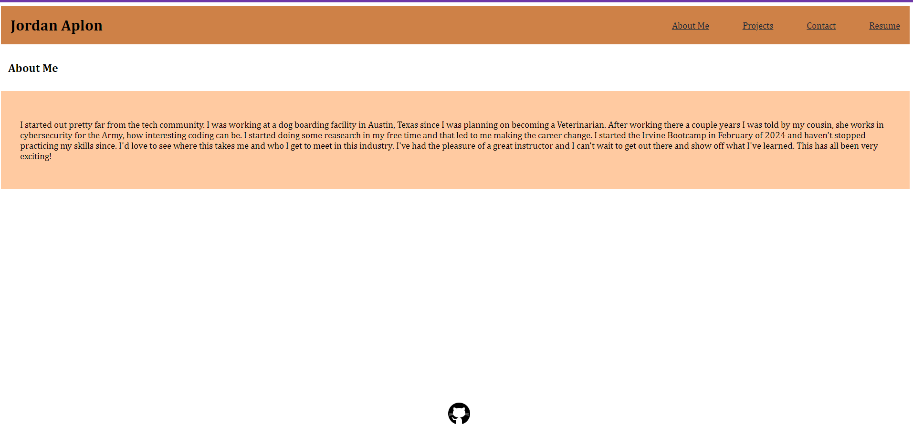

# Portfolio 
 
  

## Description

This is my personal portfolio made with React.

Deployed Link: 

## Table of Contents

- [Description](#description)
- [Usage](#usage)
- [License](#license)
- [Questions](#questions)

## Usage

This is all of the pertinent information about me and my skillset.

## License

This project is licensed under the MIT license.

## Questions

For questions or feedback regarding this project, please contact me at JoAplon, through my [github](https://github.com/undefined), or my email, jordan0aplon@gmail.com.

